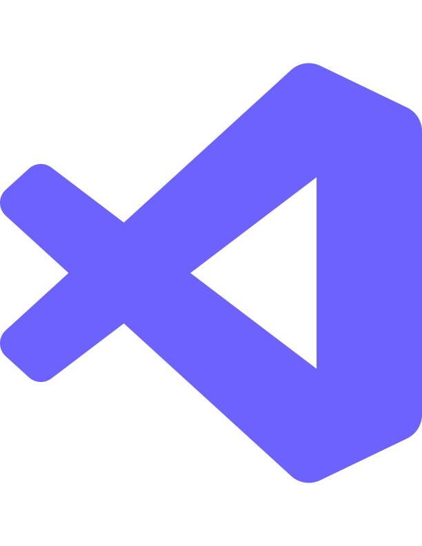
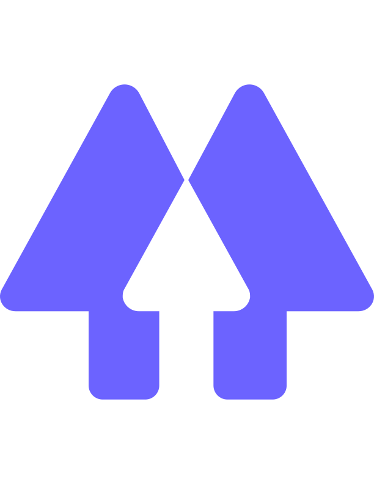

  

<h1 align="center">Hi, I'm Josh </h1>

<h3 align="left">📮 Socials</h3>

[][portfolio]
[][linkedin]
[][gmail]
[][linktree]

 

<h3 align="left">🐶 Who Am I?</h3>

- ☕ I'm a fullstack developer
- 🐶 I'm an animal lover
- 🔭 I’m currently working on [Deakin's Computer Science club's website](https://github.com/orgs/DeakinSEC/dashboard)
- 👯 I’m looking to collaborate on [my University's LMS](https://github.com/doubtfire-lms)
- 🌱 I’m currently learning **ReactJS and Gatsby**
- 📫 How to reach me **josh.piper1505@yahoo.com**
- ⚡ Fun fact **I've read all the One Piece manga chapters!**

<h3 align="left">🛠 My tools</h3>
<h4 >Frontend</h4>

 
 
 
 
 
 
 
 

<h4 >Backend</h4>

 
 
 
 
 
 
 

    🌎 My stats

 

[portfolio]: https://joshuapiper.dev
[linkedin]: https://www.linkedin.com/in/joshua-e-piper/
[gmail]: mailto:/josh.piper1505@yahoo.com
[linktree]: https://linktr.ee/joshua_piper
